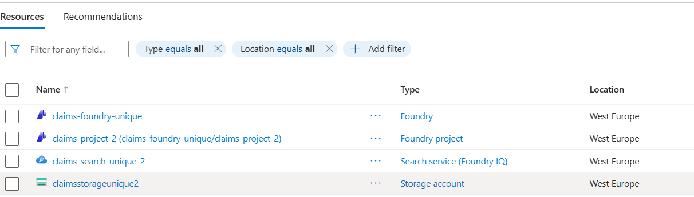

# Challenge 1 - Prepare the Environment

**[Home](../README.md)** | [Next challenge](challenge-02.md)

## Objective

Prepare a development environment and connect the microhack to Azure resources in
your own tenant and subscription. You can work in GitHub Codespaces or locally, and
you can deploy an isolated lab stack or connect resources your organization already
owns.

## Before you begin

You need:

* access to this repository;
* Python 3.11 and `uv` 0.9.17 or later;
* Azure CLI and an authenticated Azure account;
* an Azure subscription where you can read the selected resources and list the Search
	admin key; and
* permission to create role assignments on the Foundry, Search, and Storage resources.

In `deploy` mode, you also need permission to create a resource group, Foundry
resources and model deployments, Azure AI Search, Storage, and ARM deployments. Azure
Contributor can create resources but can't create role assignments. An administrator
can run the connection phase separately when your organization splits these duties.
See [Foundry RBAC](https://learn.microsoft.com/azure/ai-foundry/concepts/rbac-azure-ai-foundry)
and [Azure AI Search RBAC](https://learn.microsoft.com/azure/search/search-security-rbac).
The setup supports Foundry and Storage resources with local authentication disabled:
model calls and Blob operations then use Microsoft Entra ID. The Search service must
still allow its admin key for the supplied challenge scripts and Foundry connection.

## Tasks

### 1. Choose a development environment

#### Option A: GitHub Codespaces

Open the repository on GitHub, select **Code** > **Codespaces** > **New with
options**, and choose the **Python 3** dev container configuration. Wait for its
post-create command to install the pinned dependencies.

#### Option B: Local VS Code or terminal

Clone and open the repository. Confirm the local tools, then install the pinned
environment:

```bash
python --version
az --version
python -m pip install uv==0.9.17
uv sync
```

Activate the environment on macOS, Linux, or in a Codespace:

```bash
source .venv/bin/activate
```

On Windows PowerShell, use:

```powershell
.\.venv\Scripts\Activate.ps1
```

Python must report version 3.11 because the project pins `>=3.11,<3.12`.

#### Optional private package registries

The Dev Container uses Microsoft's npm and PyPI package feed proxies by default, so a
fresh checkout does not need direct access to `registry.npmjs.org`, `pypi.org`, or
`files.pythonhosted.org`. Corporate networks may additionally use one or both of these
controls:

* A **package registry mirror** replaces `registry.npmjs.org` or `pypi.org` with an
	approved internal package source.
* A **forward proxy** carries outbound HTTP and HTTPS traffic without changing the
	package source URL.

When your organization requires different package sources or a forward proxy, create
the local override **before** selecting **Reopen in Container**.
On macOS or Linux:

```bash
cp .devcontainer/local.env.example .devcontainer/local.env
```

On Windows PowerShell:

```powershell
Copy-Item .devcontainer/local.env.example .devcontainer/local.env
```

Open `.devcontainer/local.env`, uncomment the package registry variables, and replace
the placeholder hosts. If your organization uses a forward proxy, uncomment
`HTTP_PROXY`, `HTTPS_PROXY`, and `NO_PROXY` as required. Quote values containing
shell-special characters and URL-encode proxy credentials. When the organization
installs its trusted CA in the container, `UV_NATIVE_TLS=true` makes uv use that system
trust store. Do not disable TLS certificate verification. The local override is
excluded from Git, so customer-specific URLs and credentials aren't published.

Dev Container startup has two separate network phases:

1. Docker builds the image and downloads the base image, pinned uv image, locked Dev
	Container features, and their installation assets. `.devcontainer/local.env` is not
	available in this phase. Configure the proxy and trusted corporate CA in Docker
	Desktop or the Dev Box host when these downloads are restricted.
2. The running container executes `.devcontainer/post-create.sh`. This script loads
	`.devcontainer/local.env` before the uv binary resolves the Python environment.
	The pinned uv binary is copied from its official container image because restricted
	PyPI mirrors may not carry uv itself. The Node feature intentionally skips the
	unused `pnpm` installation, so the image build does not contact the public npm
	registry for that package.

After changing Docker network settings or `.devcontainer/devcontainer.json`, run
**Dev Containers: Rebuild Container Without Cache**. After changing only
`.devcontainer/local.env`, run **Dev Containers: Rebuild Container** or execute the
post-create script again from an existing container:

```bash
bash .devcontainer/post-create.sh
```

If the log fails in a `dev_containers_target_stage` step, the problem belongs to the
image-build phase and must be fixed in Docker or Dev Box networking. If it fails after
`Using local package and proxy settings`, verify the local registry/proxy values and
the corporate CA without posting their credentials in an issue or chat.

### 2. Sign in to the customer Azure subscription

Use your organization-provided Azure identity:

```bash
az login
az account set --subscription "<subscription-id>"
az account show --query "{subscription:name, subscriptionId:id, tenantId:tenantId}"
```

For a browser-based Codespace, you can use device-code authentication:

```bash
az login --use-device-code
```

Confirm that the displayed tenant and subscription are the ones where the lab should
run. The setup refuses to continue when `tenantId` in the customer configuration does
not match the active Azure CLI session.

### 3. Create the customer resource configuration

On macOS, Linux, or in a Codespace:

```bash
cp labautomation/customer-resources.example.json labautomation/customer-resources.json
```

On Windows PowerShell:

```powershell
Copy-Item labautomation/customer-resources.example.json labautomation/customer-resources.json
```

Open `labautomation/customer-resources.json` and set:

* `subscriptionId`, optional `tenantId`, and `location`;
* your Microsoft Entra user object ID in `participantObjectId`; retrieve it with
	`az ad signed-in-user show --query id --output tsv`;
* globally unique Foundry, Search, and Storage names;
* the Foundry project name; and
* model deployment names and capacities available in your subscription.

The file contains resource identifiers, not secrets. It is excluded from Git.

Choose one mode:

* **`deploy`:** All resource groups under `resources` must match
	`deployment.resourceGroup`. The setup creates the complete isolated lab stack.
* **`existing`:** Set the exact names and resource groups of your existing Foundry
	account and project, Search service, and Storage account. Resources can be in
	different resource groups but must be in the configured tenant and subscription.
	Both configured model deployments must already exist.

Before selecting a region for `deploy`, verify that the required services, SKUs, both
models, and enough quota are available for your subscription. Availability is not the
same in every region.

Validate the configuration locally without changing Azure:

```bash
python labautomation/setup_lab.py --config labautomation/customer-resources.json check
```

In `deploy` mode, run the subscription-aware region preflight:

```bash
python labautomation/setup_lab.py --config labautomation/customer-resources.json check-region
```

It checks regional support for Storage, Azure AI Search `Basic`, Microsoft Foundry,
both configured model SKUs, and the required model quota. If the selected region is
unsuitable, it reports the reasons and suggests up to three regions that support the
complete lab stack. The `deploy` and `all` commands repeat this check automatically.

### 4. Prepare the Azure resources

Run the complete setup:

```bash
python labautomation/setup_lab.py --config labautomation/customer-resources.json all --what-if
```

> **Allow time for this step:** The command can run for several tens of minutes,
> depending on Azure resource and model deployment times. `--what-if` adds a preview
> before the actual deployment; it does not skip deployment. Keep the terminal open.
> The setup prints phase changes and periodic status updates while Azure operations
> are still running.

In `deploy` mode, the command validates the ARM template, displays a What-if preview,
deploys the resources, configures access, creates the Foundry connections, uploads the
policy documents, and writes `.env`.

In `existing` mode, it skips ARM deployment. It validates the explicitly named
resources and model deployments, configures access and Foundry connections, creates
the Blob containers when needed, uploads the policy documents, and writes `.env`.

No secret values are displayed. The repository-root `.env` is excluded from Git and
restricted to the current user where the operating system supports file permissions.
When Foundry local authentication is disabled, the Mistral scripts use
`DefaultAzureCredential`. When Storage shared keys are disabled, Blob upload uses the
participant identity and the Search knowledge source uses its managed identity. Search
continues to use an admin key. This mixed setup is intended for the time-boxed lab, not
as a production identity and network design.

The deploy template enables the Storage public endpoint so the local Dev Container can
upload the lab files, while shared-key authentication remains disabled. Customer Azure
Policies can deny the deployment or change these settings. If that happens, review the
effective policy assignments with the customer's Azure administrator and use an
approved exception or private-connectivity design for that environment.

If an administrator must perform role assignments separately, set
`deployment.deployRoleAssignments` to `false` before deployment, then run the phases
as:

```bash
python labautomation/setup_lab.py --config labautomation/customer-resources.json deploy --what-if
python labautomation/setup_lab.py --config labautomation/customer-resources.json connect
python labautomation/setup_lab.py --config labautomation/customer-resources.json configure
```

The administrator can run `connect`; the participant can then run `configure` when
they can list the Search admin key and have Storage Blob Data Contributor access.

### 5. Validate the environment



Verify the selected Azure resources and model deployments:

```bash
python labautomation/setup_lab.py --config labautomation/customer-resources.json check --azure
```

Confirm that the participant CLI and `.env` contract load:

```bash
python docs/claims-intake-agent.py --help
```

At this point Azure contains the services, model deployments, containers, access
assignments, and Foundry connections. Challenge 2 deliberately creates and populates
the `crash-statements` Search index and creates its knowledge source and knowledge
base.

## Troubleshooting

* **Azure CLI uses the wrong tenant or subscription:** Run `az logout`, then sign in
	again with `az login --tenant <tenant-id>` and select the subscription.
* **A role assignment fails:** Ask an Owner, User Access Administrator, or Role Based
	Access Control Administrator at the affected resource scope to run `connect`.
* **The Search key can't be listed:** Search local authentication must be enabled and
	the setup identity needs permission to list the configured service's admin keys.
* **Blob upload is denied:** Rerun `connect`, confirm the participant has Storage Blob
	Data Contributor, and verify the Storage network policy permits the Dev Container's
	data-plane connection.
* **Blob upload reports that Storage network rules may block the request:** Check the
	account with `az storage account show --name <storage-name> --resource-group
	<resource-group> --query publicNetworkAccess`. If it returns `Disabled`, and an
	update immediately returns to `Disabled`, an inherited Azure Policy is modifying the
	account. Ask the customer's Azure administrator to identify the effective policy
	assignment and its definition reference that modifies `publicNetworkAccess`.
	Ask the Azure administrator for a private endpoint reachable from the development
	environment or an approved, time-limited exemption scoped to the Storage account.
	An administrator with `Microsoft.Authorization/policyExemptions/write` can exempt
	only that public-network rule from the customer's policy assignment:

	```bash
	az policy exemption create \
	  --name claims-storage-public-network-lab \
	  --display-name "Claims MicroHack Storage network access" \
	  --description "Temporary exception for uploading MicroHack lab data" \
	  --exemption-category Waiver \
	  --expires-on "<ISO-8601-expiration>" \
	  --scope "<storage-resource-id>" \
	  --policy-assignment "<effective-policy-assignment-id>" \
	  --policy-definition-reference-ids "<public-network-policy-reference-id>"
	az storage account update --ids "<storage-resource-id>" \
	  --public-network-access Enabled
	python labautomation/setup_lab.py \
	  --config labautomation/customer-resources.json configure
	```

	Use literal IDs or define and verify shell variables in the same terminal; an empty
	`--scope` produces an authorization error at `/providers/Microsoft.Authorization/
	policyExemptions/...`. Do not make the setup create this governance exception
	automatically. After the lab, disable public access before deleting the exemption:

	```bash
	az storage account update --ids "<storage-resource-id>" \
	  --public-network-access Disabled
	az policy exemption delete --name claims-storage-public-network-lab \
	  --scope "<storage-resource-id>"
	```
* **A model deployment isn't found:** Correct its deployment name in the customer
	configuration or deploy that model in the configured Foundry account.
* **ARM reports unavailable model, SKU, capacity, or quota:** Select a region and
	capacity supported by the customer subscription, then rerun setup.
* **A Codespace doesn't finish starting:** Review its creation log and rebuild the
	container. The same setup can also be run from a local Python 3.11 environment.

## Cleanup

For `deploy` mode only, remove the resource group when the lab is finished:

```bash
python labautomation/setup_lab.py --config labautomation/customer-resources.json cleanup --yes
```

Cleanup refuses to delete resources configured with `existing` mode.

## Conclusion

Your development environment and customer-owned Azure resources are ready. Continue
to [Challenge 2](challenge-02.md) to build the Claims Intake Agent.